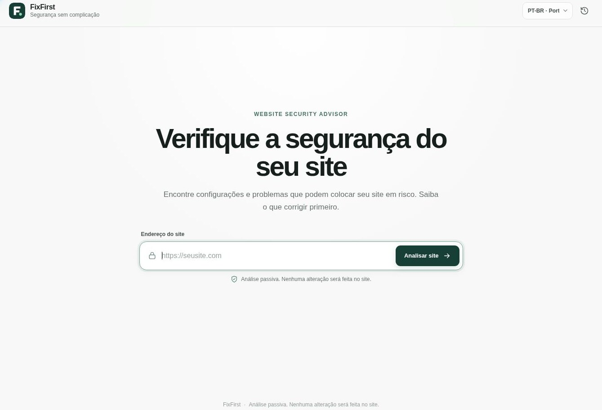
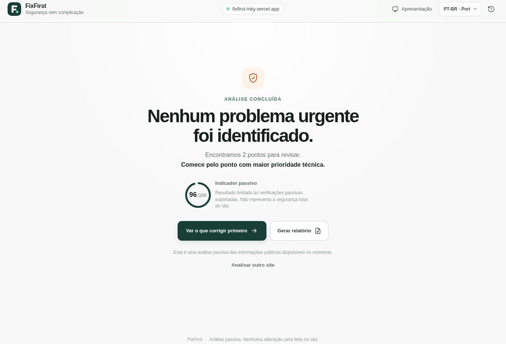
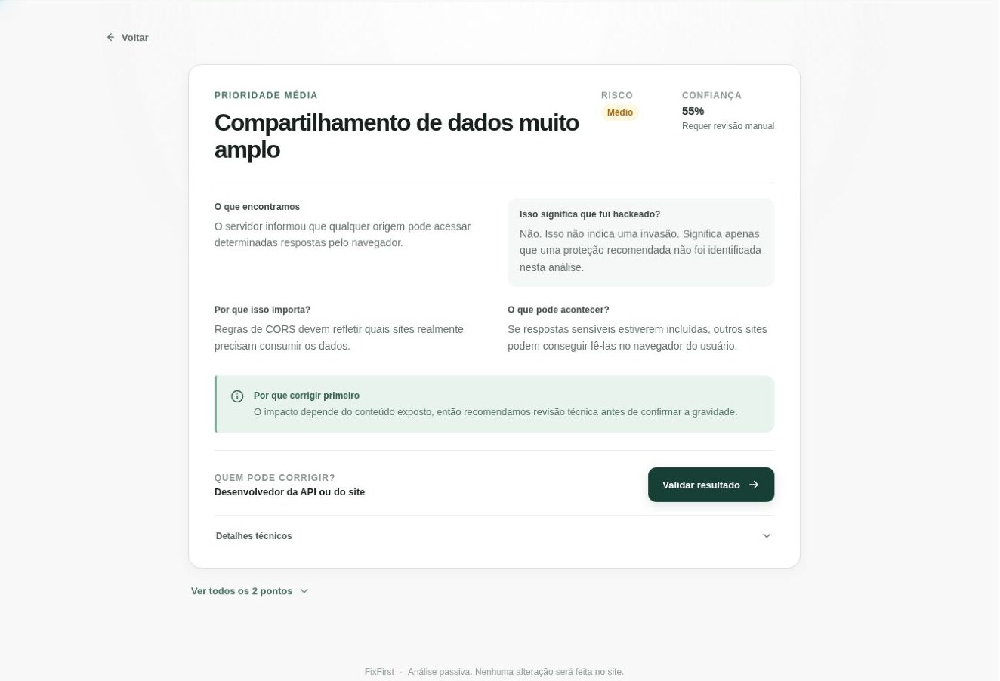
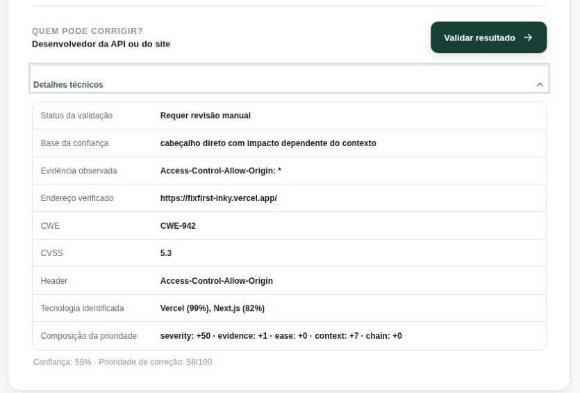

# FixFirst

[Português](README.md) | **English**

Website Security Advisor

FixFirst is a defensive web application that turns a focused set of passive security checks into an ordered remediation workflow. It records the evidence behind each finding, separates severity from confidence, explains why one item comes first, provides sourced remediation guidance, and runs the relevant check again after a change.

The project is designed as an honest MVP. It does not claim to replace a penetration test or measure the complete security of a website.

## Problem

Many scanners stop after returning technical output. A site owner still needs to decide whether the result is supported by evidence, what deserves attention first, who can fix it, and how to confirm the change.

FixFirst focuses on that gap between detection and action.

## Solution

The implemented flow is:

1. The user enters a public website and confirms authorization.
2. The server validates the URL and applies outbound request controls.
3. A bounded passive request collects the public response.
4. The analyzer creates findings and a check ledger from observed evidence.
5. Deterministic confidence and priority rules order the findings.
6. The interface presents a simple explanation and a sourced technical Playbook.
7. A Retest performs a new request and reevaluates the same check.
8. Reports use only the result returned by the scanner.

## Live Demo

[Open FixFirst](https://fixfirst-inky.vercel.app)

The public deployment uses HTTPS and opens without a login. On September 2, 2026, the page, response headers, API policies, and an authorized self-scan were verified directly in Vercel production.

## How it works

These are real captures from the public version. The scan uses FixFirst's own domain as an authorized target, so the result may change as the deployment evolves. The interface shown below is in PT-BR; English and Spanish are available from the language selector.

### 1. Enter the website

Enter a public address that you are authorized to assess. FixFirst runs a passive check without login or changes to the website.



### 2. Review the overview

The summary shows the indicator limited to supported checks and the number of items that deserve review.



### 3. Understand the priority

The simple analysis translates the first item into impact, context, and a suggested owner.



### 4. Inspect the technical evidence

The expanded view shows status, confidence, evidence, CWE and CVSS, detected technology, and the priority composition.



## Current capabilities

| Area | Implemented behavior |
| --- | --- |
| Transport | Detects HTTP use and inspects TLS certificate metadata when the runtime exposes it |
| Headers | Checks CSP, frame protection, HSTS, `nosniff`, Referrer-Policy, and Permissions-Policy |
| Cookies | Reviews the first 20 observed `Set-Cookie` values for Secure, HttpOnly on session-like cookies, and SameSite |
| Browser content | Looks for direct HTTP resource references only when a bounded HTML or XHTML body was actually analyzed |
| CORS | Records a wildcard origin as contextual evidence that requires manual review |
| Technology signals | Reports limited server, platform, and HTML signals with an explicit confidence value |
| Prioritization | Uses severity, evidence confidence, ease, observed page context, and two documented finding combinations |
| Remediation | Provides PT-BR, English, and Spanish Playbooks backed by OWASP, MDN, and official server or framework documentation |
| Retest | Makes a new request and marks a finding fixed only when the same check conclusively passes |
| Reports | Produces simple and technical print-ready reports from the real scan result |
| Local history | Stores up to eight recent results in the current browser only |
| Product analytics | Records explicit anonymous funnel events through a validated same-origin server route when PostHog is configured |

The complete check definitions and formulas are in [Scanner methodology](docs/SCANNER-METHODOLOGY.en.md).

## Remediation workflow

Each finding connects five kinds of information: observed evidence, a plain-language explanation, the recommended owner, a versioned Playbook, and the status of a new check. Technology-specific examples are shown only when a supported technology signal reaches at least 80% confidence. Otherwise, FixFirst uses a generic guide.

Context-dependent evidence follows a validation-first route. For example, `Access-Control-Allow-Origin: *` is directly observable, but its impact depends on whether the response is public, authenticated, or sensitive.

## Security architecture

The scanner receives user-controlled URLs, so its outbound request path is treated as a trust boundary. The server allows only HTTP and HTTPS on ports 80 and 443, rejects credentials and local hostnames, resolves DNS before each request, blocks private and reserved address ranges, and revalidates every redirect.

On a standard Node.js runtime, the selected public IP is pinned to the socket while the original hostname is retained for the Host header and TLS SNI. The current Cloudflare target uses the platform fetch transport after DNS validation because direct sockets to Cloudflare address ranges are restricted by that runtime. The platform transport relies on the provider's outbound network isolation and reports TLS checks as not evaluated when certificate metadata is unavailable.

Requests share one 12-second deadline. Redirects are limited to three, response headers to 64 KiB, and an analyzed HTML body to 512 KiB. The scan API accepts at most 8 KiB of JSON, applies same-origin browser checks, returns no-store responses, and uses a bounded per-instance rate limiter.

Analytics uses a separate route, a 4 KiB request limit, closed event and property allowlists, anonymous identifiers, no person profiles, no target URL, and no browser credentials or referrer data.

See [Architecture](docs/ARCHITECTURE.en.md), [Security controls](docs/SECURITY-CONTROLS.en.md), and [Threat Model](THREAT_MODEL.en.md) for implementation details and residual risk.

## Testing

The automated suite covers URL parsing, IPv4 and IPv6 scope controls, redirect revalidation, pinned connections, body and header limits, timeouts, positive and negative findings, deterministic priority, confidence handling, API request policy, page response headers, Playbook completeness, Retest outcomes, and privacy-minimized analytics payloads.

Run the complete local verification with:

```bash
npm ci
npm run lint
npm test
npm audit --audit-level=high
npm run build
npm run build:next
```

GitHub Actions is prepared to run the same checks with a read-only token. A separate CodeQL workflow analyzes JavaScript using the security-and-quality query suite. Actions are pinned to full commit SHAs, and neither workflow receives deployment credentials.

## Architecture and stack

| Layer | Technology |
| --- | --- |
| Application | Next.js 16 App Router, React 19, JavaScript modules |
| Private preview build | vinext and Cloudflare Workers compatibility |
| Standard deployment build | Next.js Node.js runtime |
| Scanner transport | Node.js `net` and `tls`, or bounded platform fetch on Cloudflare |
| State | React state and browser `localStorage` for local history plus anonymous analytics identifiers |
| Product analytics | Explicit same-origin events relayed to the PostHog Capture API when server configuration is present |
| Tests | Node.js test runner and local TCP fixtures |
| Quality | ESLint, npm audit, GitHub Actions, Dependabot, and CodeQL configuration |

There is no database, user account system, external storage, browser analytics SDK, or required administrative secret. Production PostHog delivery is configured server-side only, and real variable values are absent from source, browser code, and documentation.

## Usage metrics

The product flow is instrumented with explicit, allowlisted PostHog events. Production forwards anonymous events to a private dashboard with IP discard enabled. Initial validation confirmed real page visits, but the project does not publish counts until a representative measurement period exists. The event model, funnel, and data minimization rules are documented in [Analytics](docs/ANALYTICS.en.md).

## Limitations

1. FixFirst analyzes one public response from the website root. It does not crawl the site, authenticate, submit forms, or execute offensive payloads.
2. A missing header is evidence about the analyzed response, not proof that every route has the same configuration.
3. TLS certificate findings require certificate metadata. They are not reported as passed when the runtime cannot provide that evidence.
4. Technology detection is limited to public signals and can be incomplete. It is not used as proof of a vulnerability.
5. Cookie checks cover only cookies visible in the response and stop after 20 values.
6. The passive indicator is scoped to supported checks. It is not a percentage of total security.
7. The in-memory rate limiter is per process or serverless instance. Vercel provides automatic DDoS mitigation, but no billed distributed rate limiting is enabled. Distributed traffic can still bypass the local limit.
8. The Cloudflare fetch transport validates DNS before each hop but cannot pin that answer to the platform request. Provider network isolation is therefore part of the control.
9. Analytics can undercount people using privacy signals, content blockers, or cleared browser storage.
10. FixFirst does not replace secure code review, authenticated testing, infrastructure review, or a professional penetration test.

## Roadmap

The public repository, unauthenticated Vercel deployment, and private PostHog dashboard are active. Next steps are observing real usage, evaluating a distributed limit that introduces no charge without approval, and validating more Retest cycles. Broader crawling and additional findings remain out of scope until the current checks have enough validation.

## What I learned

Building FixFirst made the scanner itself part of the security problem. Accepting a URL required more than blocking `127.0.0.1`; it required reasoning about IPv6, cloud metadata, redirects, DNS changes, request deadlines, response limits, and the difference between validating an address and connecting to that exact address.

The project also made evidence quality visible. Severity describes potential impact, while confidence describes how directly FixFirst observed the condition. Keeping those concepts separate led to clearer prioritization, safer handling of contextual CORS results, and a Retest that can remain inconclusive instead of claiming a fix.

Finally, remediation became a maintained part of the product rather than generated filler. The Playbooks have versions, review dates, source links, prerequisites, validation steps, and rollback guidance. That structure makes recommendations easier to test and update without changing the scanner logic.

## Security reporting

Please read the [security policy](SECURITY.en.md) before reporting a vulnerability. Do not place exploit details or sensitive information in a public issue.

## License

Released under the MIT License. See [LICENSE](LICENSE).
