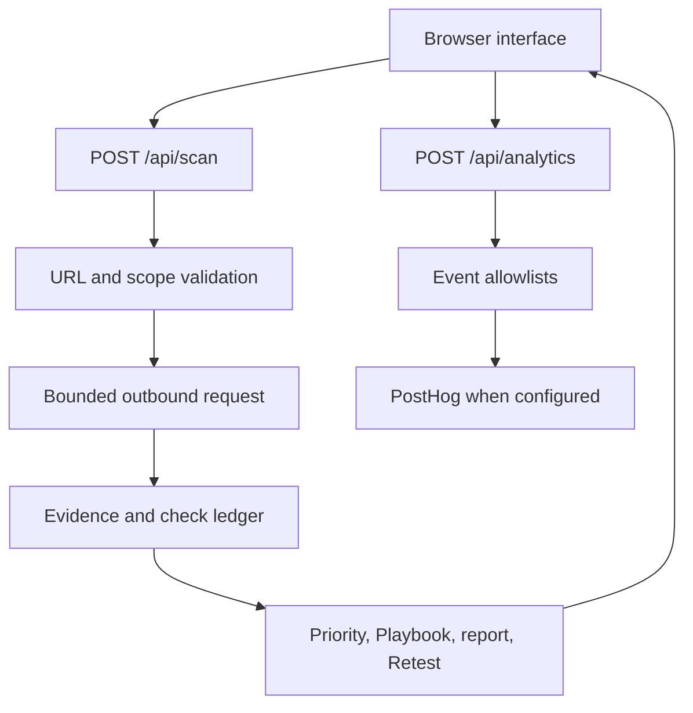

# Architecture

Last reviewed: 2026-09-02

[Português](ARCHITECTURE.md) | **English**

## Overview

FixFirst keeps the interface, scanner transport, evidence analysis, priority rules, remediation library, Retest decision, and product analytics boundaries separate. The application has no database or user account system.

## Components

| Component | Location | Responsibility |
| --- | --- | --- |
| Interface | `components/FixFirstApp.js` | Input, authorization, results, guides, reports, local history, Retest actions, and real event triggers |
| Page response policy | `proxy.js`, `lib/security-headers.js` | Applies one shared set of browser security headers in Next.js and vinext |
| Scan API policy | `app/api/scan/route.js` | Request size, content type, same-origin policy, authorization flag, rate limit, error mapping, and response headers |
| URL validator | `lib/scanner/validate-url.js` | URL normalization, protocol and port allowlists, hostname scope, DNS resolution, and address range checks |
| HTTP client | `lib/scanner/http-client.js` | Deadline, redirects, socket pinning, platform fetch, HTTP parsing, and response limits |
| Analyzer | `lib/scanner/analyze.js` | Check ledger, findings, confidence, technology signals, priority, chains, and passive indicator |
| Playbooks | `lib/playbooks.js` | Versioned generic and technology-aware guidance with official sources |
| Scanner rate limiter | `lib/scanner/rate-limit.js` | Bounded per-instance scan buckets |
| Analytics client | `lib/analytics/client.js` | Anonymous visitor and session UUIDs, privacy signals, device category, and same-origin event delivery |
| Analytics schema | `lib/analytics/events.js` | Stable event names plus closed property and value allowlists |
| Analytics API | `app/api/analytics/route.js` | Origin, request size, event schema, volume limit, and PostHog delivery policy |
| Analytics delivery | `lib/analytics/server.js` | PostHog host allowlist and anonymous Capture API payload |
| Language data | `lib/i18n.js` | PT-BR, English, and Spanish interface and finding copy |

## Scanner request flow

1. The browser reduces user input to an origin root and asks for explicit authorization.
2. The API accepts only a small JSON body. Browser requests with a cross-site Origin or `Sec-Fetch-Site` value are rejected.
3. Server-side normalization repeats the URL checks. Client validation is only a usability layer.
4. The scanner validates the target, resolves every available A and AAAA answer, and rejects the request if any answer is unsafe.
5. The transport performs one bounded GET request. A redirect starts the same validation process again.
6. Only HTML and XHTML bodies with identity encoding are inspected. Other bodies are not copied into the result.
7. The analyzer produces findings and a status for every supported check. A missing evidence source becomes `not_evaluated`, not a pass.
8. The browser renders simple guidance, technical details, Playbooks, and reports from that result.
9. A Retest repeats the full server request and reads the status of the same finding code.

Page responses receive their browser security policy through the Next.js 16 `proxy.js` convention. API responses build on the common header set but replace page CSP with `default-src 'none'` and use `Referrer-Policy: no-referrer`.

## Analytics event flow

1. A real interface transition calls the analytics client with a documented event name and product properties only.
2. The client honors Global Privacy Control and Do Not Track before creating identifiers.
3. A random visitor UUID persists in `localStorage`. A session UUID renews after 30 minutes without activity.
4. The browser sends no cookie, referrer, current URL, target domain, form content, or scan evidence.
5. The API checks same-origin policy, a 4 KiB limit, its local rate limit, and the complete closed schema.
6. With valid server configuration, the API sends an anonymous event to the PostHog Capture API. Without it, delivery is disabled.

The PostHog payload includes `$process_person_profile: false` and `$geoip_disable: true`. The project account must also discard captured IP data. See [Analytics](ANALYTICS.en.md) for the event catalog and privacy decisions.

## Runtime transports

| Runtime | Connection behavior | TLS evidence | SSRF property |
| --- | --- | --- | --- |
| Standard Node.js | Connects the socket to the validated public IP and retains the original hostname for Host and SNI | Certificate protocol, authorization result, dates, issuer, and subject when available | DNS answer is pinned to the connection |
| Cloudflare private preview | Uses native `fetch` after DNS validation and manually follows redirects | Reported as unavailable | Depends on platform egress isolation; DNS cannot be pinned by application code |

Cloudflare mode is selected by the non-secret `FIXFIRST_RUNTIME=cloudflare` variable and independently detected from the Workers runtime identity. Standard Node.js uses the pinned transport.

## Data handling

The server does not create user accounts or durable scan records. It returns a sanitized result with `Cache-Control: no-store`. The browser stores at most eight recent scan results in `localStorage`; clearing browser storage or using the in-app action removes them. Analytics identifiers are separate from scan history and are never included in the scan API request.

Input paths and query strings are discarded for the initial scan. Redirect paths are followed because they are part of public routing, but query strings are removed before the final URL is returned.

## Error model

Scanner internals return stable codes such as `BLOCKED_TARGET`, `DNS_FAILED`, `SCAN_TIMEOUT`, `RESPONSE_HEADERS_TOO_LARGE`, and `TOO_MANY_REDIRECTS`. The interface maps them to short messages and does not expose stack traces, resolved IPs, socket details, or target bodies. Analytics receives only a broad error category.

## Deployment boundaries

The private preview uses vinext and remains disconnected from external analytics delivery. Public Vercel production uses the standard Next.js build and forwards anonymous events to PostHog when valid configuration exists on the server only. GitHub, Vercel, and PostHog account changes follow separate owner authorization steps.
