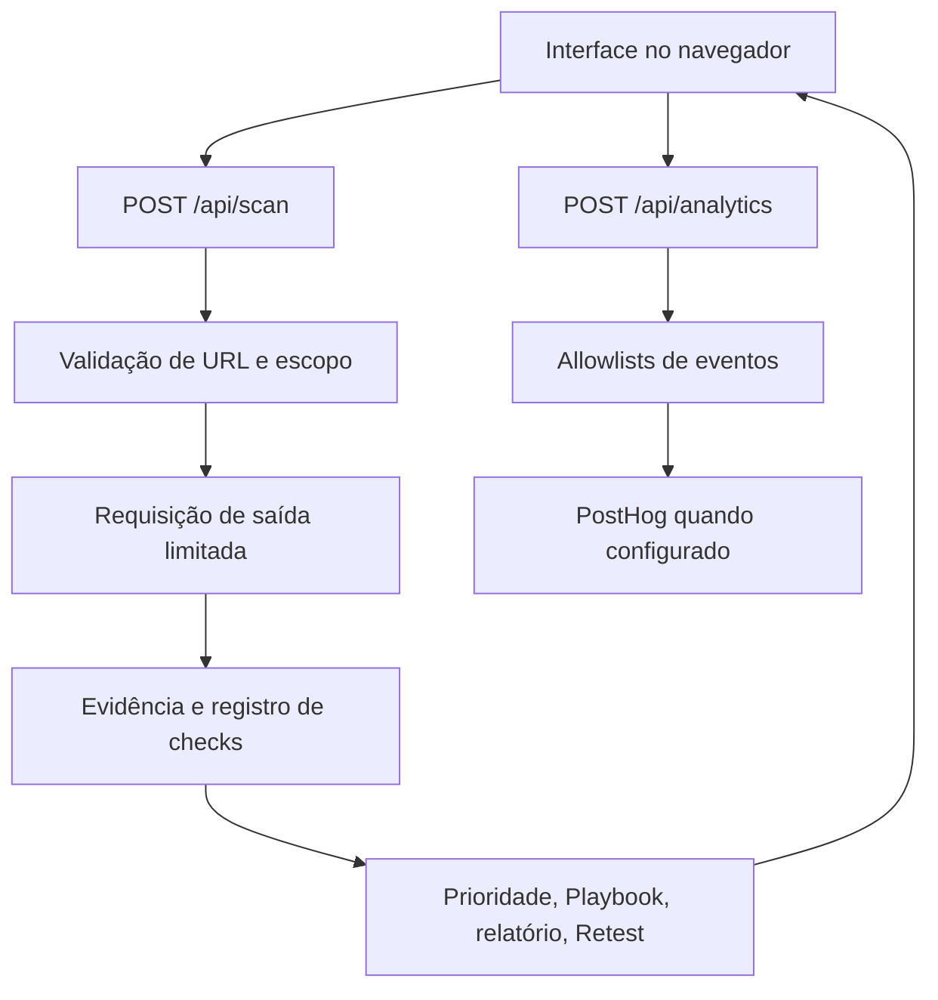

# Arquitetura

Última revisão: 2 de setembro de 2026

**Português** | [English](ARCHITECTURE.en.md)

## Visão geral

O FixFirst mantém separadas as fronteiras da interface, transporte do scanner, análise de evidência, regras de prioridade, biblioteca de remediação, decisão do Retest e Product Analytics. A aplicação não possui banco de dados nem sistema de contas de usuário.

## Componentes

| Componente | Local | Responsabilidade |
| --- | --- | --- |
| Interface | `components/FixFirstApp.js` | Entrada, autorização, resultados, guias, relatórios, histórico local, Retest e gatilhos de eventos reais |
| Política das páginas | `proxy.js`, `lib/security-headers.js` | Aplica o mesmo conjunto de headers de segurança do navegador em Next.js e vinext |
| Política da API de scan | `app/api/scan/route.js` | Tamanho, tipo de conteúdo, mesma origem, autorização, rate limit, erros e headers da resposta |
| Validador de URL | `lib/scanner/validate-url.js` | Normalização, allowlists de protocolo e porta, escopo de hostname, DNS e faixas de endereços |
| Cliente HTTP | `lib/scanner/http-client.js` | Prazo total, redirects, socket fixado, fetch da plataforma, parsing HTTP e limites da resposta |
| Analisador | `lib/scanner/analyze.js` | Registro de checks, findings, confiança, sinais de tecnologia, prioridade, combinações e indicador passivo |
| Playbooks | `lib/playbooks.js` | Orientação genérica e específica de tecnologia, versionada e com fontes oficiais |
| Rate limiter do scanner | `lib/scanner/rate-limit.js` | Buckets limitados por instância |
| Cliente de analytics | `lib/analytics/client.js` | UUIDs anônimos de visitante e sessão, sinais de privacidade, categoria de dispositivo e envio para a mesma origem |
| Schema de analytics | `lib/analytics/events.js` | Nomes estáveis e allowlists fechadas de propriedades e valores |
| API de analytics | `app/api/analytics/route.js` | Origem, tamanho, schema, limite de volume e política de entrega ao PostHog |
| Entrega do analytics | `lib/analytics/server.js` | Allowlist de hosts do PostHog e payload anônimo da Capture API |
| Idiomas | `lib/i18n.js` | Textos da interface e dos findings em PT-BR, inglês e espanhol |

## Fluxo da requisição do scanner

1. O navegador reduz a entrada à raiz da origem e solicita uma confirmação explícita de autorização.
2. A API aceita somente um corpo JSON pequeno. Requisições do navegador com Origin externo ou `Sec-Fetch-Site` cross-site são rejeitadas.
3. A normalização no servidor repete os checks da URL. A validação no cliente serve apenas à experiência de uso.
4. O scanner valida o alvo, resolve todas as respostas A e AAAA disponíveis e rejeita a requisição se qualquer endereço for inseguro.
5. O transporte faz uma requisição GET limitada. Um redirect reinicia o mesmo processo de validação.
6. Somente corpos HTML e XHTML com identity encoding são inspecionados. Outros corpos não são copiados para o resultado.
7. O analisador produz findings e um estado para cada check compatível. A ausência de uma fonte de evidência vira `not_evaluated`, e não aprovação.
8. O navegador renderiza explicação simples, detalhes técnicos, Playbooks e relatórios a partir desse resultado.
9. O Retest repete toda a requisição no servidor e consulta o estado do mesmo código de finding.

As páginas recebem a política de segurança do navegador pela convenção `proxy.js` do Next.js 16. As respostas das APIs partem dos headers comuns, mas substituem a CSP da página por `default-src 'none'` e usam `Referrer-Policy: no-referrer`.

## Fluxo dos eventos de analytics

1. Uma transição real da interface chama o cliente de analytics apenas com o nome documentado e propriedades de produto.
2. O cliente respeita Global Privacy Control e Do Not Track antes de criar identificadores.
3. Um UUID aleatório de visitante permanece no `localStorage`. Um UUID de sessão é renovado após 30 minutos sem atividade.
4. O navegador não envia cookie, referrer, URL atual, domínio alvo, formulário ou evidência do scan.
5. A API verifica mesma origem, limite de 4 KiB, rate limiter local e schema fechado completo.
6. Com configuração válida no servidor, a API envia um evento anônimo à Capture API do PostHog. Sem essa configuração, o envio fica desativado.

O payload do PostHog inclui `$process_person_profile: false` e `$geoip_disable: true`. A conta do projeto também deve descartar IPs capturados. Consulte [Analytics](ANALYTICS.md) para ver o catálogo de eventos e as decisões de privacidade.

## Transportes por runtime

| Runtime | Comportamento da conexão | Evidência TLS | Propriedade contra SSRF |
| --- | --- | --- | --- |
| Node.js padrão | Conecta o socket ao IP público validado e mantém o hostname original para Host e SNI | Protocolo, autorização, datas, emissor e subject quando disponíveis | A resposta de DNS fica fixada à conexão |
| Prévia privada na Cloudflare | Usa `fetch` nativo após validar o DNS e acompanha redirects manualmente | Registrada como indisponível | Depende do isolamento de saída da plataforma; o código não consegue fixar o DNS |

O modo Cloudflare é selecionado pela variável não secreta `FIXFIRST_RUNTIME=cloudflare` e também detectado pela identidade do runtime Workers. O Node.js padrão utiliza o transporte com conexão fixada.

## Tratamento de dados

O servidor não cria contas de usuário nem registros duráveis de scans. Ele retorna um resultado sanitizado com `Cache-Control: no-store`. O navegador mantém no máximo oito resultados recentes no `localStorage`; limpar o armazenamento ou usar a ação da interface remove esses dados. Os identificadores de analytics são separados do histórico e nunca entram na requisição da API de scan.

Caminhos e query strings da entrada são descartados no scan inicial. Caminhos de redirects são seguidos porque fazem parte do roteamento público, mas query strings são removidas antes de a URL final voltar ao navegador.

## Modelo de erros

O scanner retorna códigos estáveis como `BLOCKED_TARGET`, `DNS_FAILED`, `SCAN_TIMEOUT`, `RESPONSE_HEADERS_TOO_LARGE` e `TOO_MANY_REDIRECTS`. A interface converte esses códigos em mensagens curtas e não expõe stack traces, IPs resolvidos, detalhes de socket ou corpos retornados pelo alvo. O analytics recebe somente uma categoria ampla do erro.

## Fronteiras de deployment

A prévia privada usa vinext e permanece sem envio externo de analytics. A produção pública na Vercel usa o build padrão do Next.js e encaminha eventos anônimos ao PostHog quando a configuração válida existe somente no servidor. Mudanças nas contas do GitHub, Vercel e PostHog seguem etapas separadas de autorização do proprietário.
